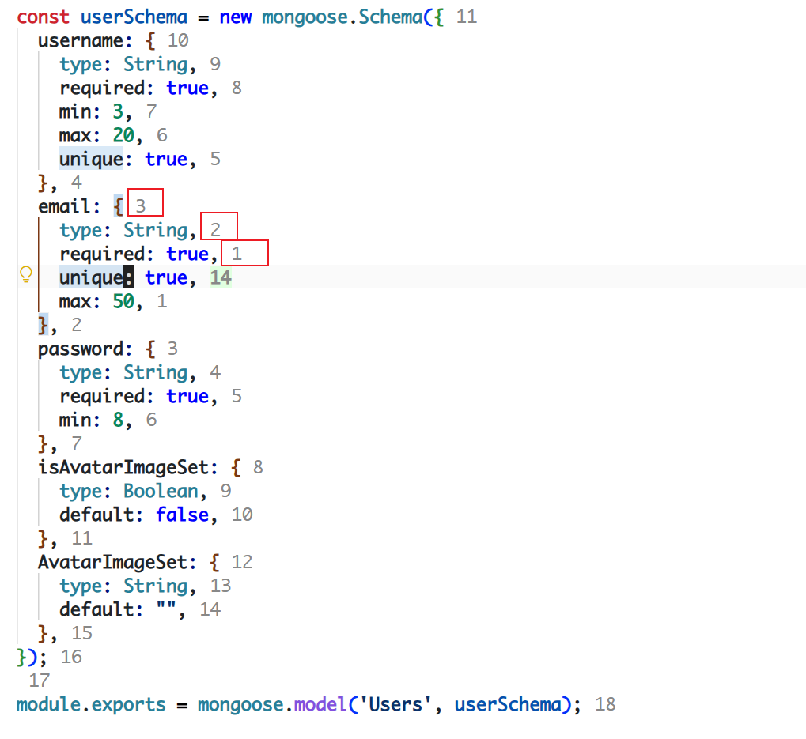

# 功能

在每行文本末尾显示行号，类似 VS Code 原生的相对行号功能，但显示在行尾。

## 特性

- **相对行号**：以当前光标行为基准，当前行显示真实行号，其他行显示相对行号
- **直观显示**：行号显示在每行文本末尾，不干扰代码内容
- **实时更新**：光标移动时行号自动更新

## 使用方法

安装插件后自动生效，无需额外配置。

---

# Features

Display line numbers at the end of each line, similar to VS Code's built-in relative line numbers, but shown at the line end.

## Features

- **Relative Line Numbers**: Based on the current cursor line, the current line shows the absolute line number, other lines show relative numbers
- **Intuitive Display**: Line numbers appear at the end of each line without interfering with code content
- **Real-time Update**: Line numbers update automatically when the cursor moves

## Usage

The plugin works automatically after installation, no additional configuration required.

# feature show

# GitHub仓库地址
[ Welcome!!! ](https://github.com/LMGAn/lineend-ranger)